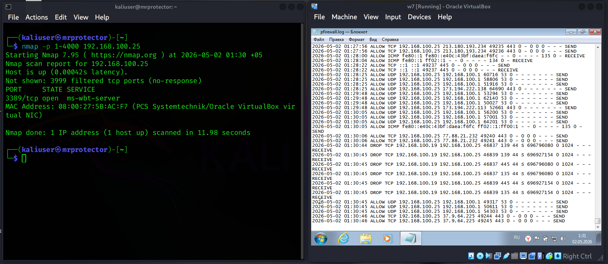
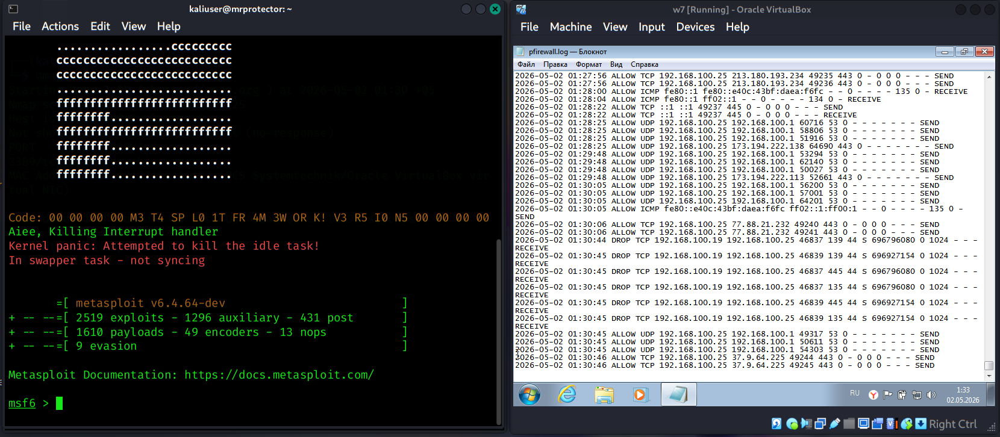
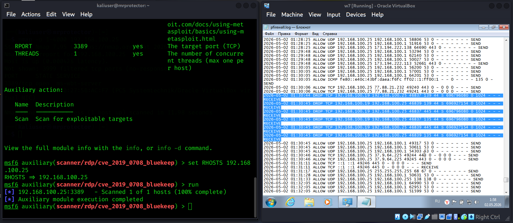
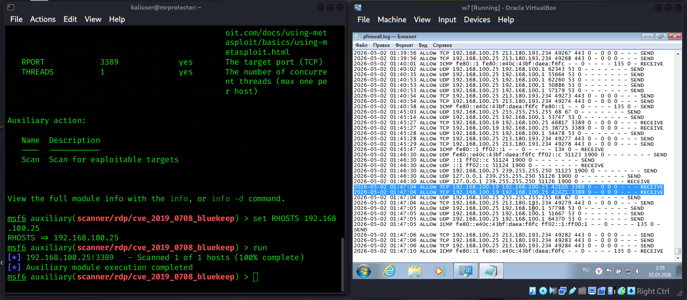
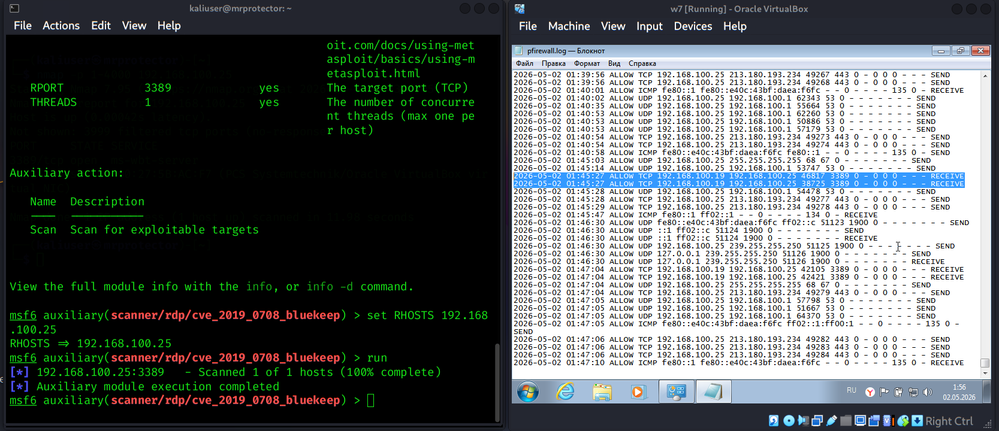

# rdp-bluekeep-detection-lab
Detection lab for RDP exposure, Nmap scanning, and BlueKeep vulnerability scanning using Metasploit and Windows Firewall logs.

This project documents a small cybersecurity lab focused on RDP exposure, BlueKeep vulnerability scanning, and detection using Windows Firewall logs.

The goal of this lab was not only to run offensive tools, but to understand how reconnaissance and vulnerability scanning activity appears from a defender’s perspective.

---

## Lab Environment

- Attacker machine: Kali Linux
- Target machine: Windows 7 VM
- Virtualization: Oracle VirtualBox
- Target IP: 192.168.100.25
- Attacker IP: 192.168.100.19
- Detection source: Windows Firewall log

---

## Project Steps

### 1. RDP Discovery with Nmap

The first step was scanning the Windows 7 VM to identify exposed services.



Nmap identified TCP port 3389 as open, which indicates that Remote Desktop Protocol was exposed.

---

### 2. Metasploit BlueKeep Scanner Module

After discovering the open RDP service, I used Metasploit to load a BlueKeep-related scanner module.



This step helped prepare the vulnerability scanning phase against the RDP service.

---

### 3. Detecting Nmap Activity in Firewall Logs

Windows Firewall logs captured multiple dropped TCP connections from the Kali machine to different destination ports.



This pattern is consistent with port scanning activity:

- Same source IP
- Multiple destination ports
- Short time window
- Dropped TCP connections

---

### 4. Detecting BlueKeep Scanner Activity

After running the Metasploit scanner, Windows Firewall logs showed repeated inbound TCP connections to RDP port 3389.



These entries show that the target received RDP-related probing activity from the attacker machine.

---

### 5. Additional RDP Scanner Evidence

Additional firewall log entries confirmed repeated connections from the same source host to TCP port 3389.



This behavior is different from a normal single RDP connection because it appears as repeated scanner-driven activity.

---

## Detection Logic

The activity can be detected using simple behavioral logic:

```text
If one source IP connects to multiple ports in a short time window,
or repeatedly connects to RDP port 3389,
then investigate for scanning or vulnerability probing activity.
```

Example indicators observed in this lab:

```text
Source IP: 192.168.100.19
Destination IP: 192.168.100.25
Target Port: 3389
Protocol: TCP
Action: ALLOW / RECEIVE
```

For Nmap scanning:

```text
Source IP: 192.168.100.19
Destination IP: 192.168.100.25
Multiple destination ports: 135, 139, 445
Action: DROP
```

## Key Findings
- RDP was exposed on TCP port 3389.
- Nmap scanning activity generated visible firewall log entries.
- Metasploit BlueKeep scanner activity appeared as repeated TCP connections to RDP.
- Windows Firewall logs can provide useful detection evidence even without a SIEM.
- Open ports do not automatically mean successful exploitation.

### Disclaimer
This lab was performed only in my own isolated virtual environment for educational and defensive cybersecurity learning purposes.
No unauthorized systems were scanned or attacked.
